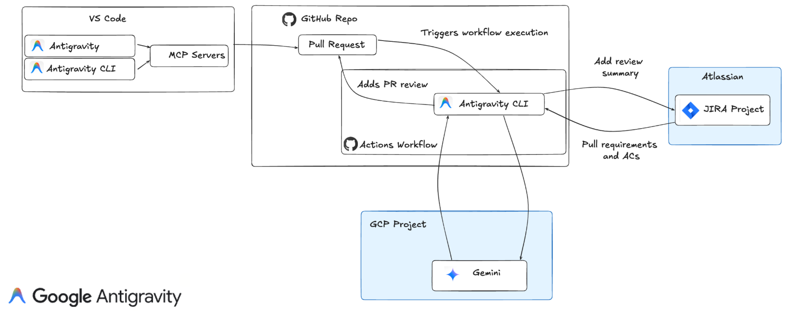

# Automated code reviews with Antigravity CLI



This guide demonstrates how to integrate the Antigravity CLI in non-interactive
mode - without requiring any user input - within GitHub Actions workflows to
automate various development tasks. By leveraging Antigravity's capabilities
directly within your CI/CD pipelines, you can streamline processes such as
generating code review summaries, drafting documentation, or creating release
notes. This automation accelerates development cycles and improves consistency
by reducing the need for manual intervention.

## Prerequisites

To follow this guide, you need:

- A Google Cloud project with the `Owner` role.
- An active Jira Cloud instance with a configured project and issues
  (if you want to test the Jira integration).
- A GitHub repository where you have write access.


## Credentials and Authentication Configuration

The Antigravity CLI requires authentication and configuration to interact with
Google Cloud, GitHub, and Atlassian services. When running in a GitHub Actions
workflow, these sensitive values must be stored as GitHub Repository Secrets.

1.  **Collect the Required Credentials:**
    - **Antigravity Credentials:** Obtain your `ANTIGRAVITY_OAUTH_TOKEN` and
      `INSTALLATION_ID` from your Antigravity setup by interactively
      authenticating locally.
    - **Google Cloud:** Obtain your Google Cloud Project ID (`GCP_PROJECT`).
    - **GitHub:** Generate a Personal Access Token (`REPO_ACCESS_TOKEN`) with
      appropriate repository permissions.
    - **Atlassian/Jira:** Get your Atlassian Host (`ATLASSIAN_HOST`), Atlassian
      API Token (`ATLASSIAN_API_TOKEN`), Jira Project Key (`JIRA_PROJECT_KEY`),
      and Jira Cloud ID (`JIRA_CLOUD_ID`).

2.  **Store Credentials as GitHub Secrets:**
    - Navigate to your GitHub repository's **Settings** tab.
    - Click on **Secrets and variables > Actions**.
    - Click **New repository secret** for each of the credentials listed above.
    - Name each secret accordingly (e.g., `ANTIGRAVITY_OAUTH_TOKEN`,
      `INSTALLATION_ID`, etc.) and paste the corresponding value.

3.  **Reference the Secrets in the Workflow:** The GitHub Actions workflow will
    reference these secrets using the standard GitHub Actions syntax (e.g., `${{ secrets.ANTIGRAVITY_OAUTH_TOKEN }}`)
    and map them to environment variables or write them to configuration files
    during the run. This ensures sensitive credentials are never exposed in the
    build logs or committed to the repository.

## GitHub Actions Workflow File Configuration

The core of the GitHub Actions integration is the workflow file, typically a
YAML file located in the `.github/workflows/` directory of the repository (e.g.,
`.github/workflows/antigravity-review.yml`). This file defines the automated
process, including the trigger event, the environment, and the steps to execute
the Antigravity CLI.

## Antigravity CLI Non-interactive Mode

The Antigravity CLI's non-interactive mode (using the `-p` or `--prompt` option)
is designed for automated environments like CI/CD pipelines. In this mode, the
CLI operates without requiring user input, making it ideal for script-based
execution within GitHub Actions workflows. It processes commands and prompts
directly, enabling automated tasks such as code analysis, content generation,
and structured output.

Sample non-interactive prompt to run a code review:

```bash
agy -p "Review the code changes in this pull request and return a summary of findings in markdown format to the console" >> $GITHUB_STEP_SUMMARY
```

## Workflow Example

```yaml
name: PR Review with Antigravity CLI

on:
  push:
    branches:
      - main
      - "feature/**"
      - "bugfix/**"
  pull_request:
    types: [opened, synchronize]
  workflow_dispatch:
    inputs:
      pr_number:
        description: "PR number to review"
        required: false

jobs:
  autonomous-docs-audit:
    runs-on: ubuntu-latest
    name: Antigravity Review
    # Adding explicit permissions for PR comments
    permissions:
      contents: read
      pull-requests: write
    env:
      PR_NUMBER: ${{ github.event.pull_request.number || inputs.pr_number }}
      REPO: ${{ github.repository }}
      ATLASSIAN_API_TOKEN: ${{ secrets.ATLASSIAN_API_TOKEN }}
      ATLASSIAN_HOST: ${{ secrets.ATLASSIAN_HOST }}
      JIRA_PROJECT_KEY: ${{ secrets.JIRA_PROJECT_KEY }}
      REPO_ACCESS_TOKEN: ${{ secrets.REPO_ACCESS_TOKEN }}
      AGY_CONFIG_DIR: ${{ github.workspace }}/.gemini/antigravity-cli
      JIRA_CLOUD_ID: ${{ secrets.JIRA_CLOUD_ID }}
      ANTIGRAVITY_OAUTH_TOKEN: ${{ secrets.ANTIGRAVITY_OAUTH_TOKEN }}
      INSTALLATION_ID: ${{ secrets.INSTALLATION_ID }}
      GCP_PROJECT: ${{ secrets.GCP_PROJECT }}

    steps:
      - name: Checkout Repository
        uses: actions/checkout@v4

      - name: Setup Node.js
        uses: actions/setup-node@v4
        with:
          node-version: "22"

      - name: Install Antigravity CLI
        run: |
          curl -fsSL https://antigravity.google/cli/install.sh | bash

      - name: Install Dependencies
        run: npm install

      - name: Configure Antigravity CLI MCP and Extensions
        run: |
          mkdir -p $AGY_CONFIG_DIR

          # Write the MCP configs - GitHub and Atlassian
          cat <<EOF > $AGY_CONFIG_DIR/mcp_config.json
          {
            "mcpServers": {
              "atlassian": {
                "command": "npx",
                "args": [
                  "-y",
                  "mcp-remote@latest",
                  "https://mcp.atlassian.com/v1/mcp",
                  "--header",
                  "Authorization: Bearer $ATLASSIAN_API_TOKEN"
                ]
              },
              "github": {
                "command": "npx",
                "args": [
                  "-y",
                  "@modelcontextprotocol/server-github"
                ],
                "env": {
                  "GITHUB_PERSONAL_ACCESS_TOKEN": "$REPO_ACCESS_TOKEN"
                }
              }
            }
          }
          EOF

      - name: Configure Antigravity CLI Settings
        run: |
          mkdir -p ~/.gemini/antigravity-cli
          cat <<EOF > ~/.gemini/antigravity-cli/settings.json
          {
            "colorScheme": "dark",
            "gcp": {
              "project": "$GCP_PROJECT",
              "location": "global"
            },
            "model": "Gemini 3.5 Flash (Low)",
            "trustedWorkspaces": [
              "/home/runner/work"
            ]
          }
          EOF

      - name: Configure Antigravity CLI Credentials
        run: |
          mkdir -p ~/.gemini/antigravity-cli
          echo -n "$ANTIGRAVITY_OAUTH_TOKEN" > ~/.gemini/antigravity-cli/antigravity-oauth-token
          echo -n "$INSTALLATION_ID" > ~/.gemini/antigravity-cli/installation_id

      - name: Run Code Review
        run: |
          agy --dangerously-skip-permissions -p "
            You are a rigorous Senior Technical Architect. 
            Your task is to review GitHub Pull Request #$PR_NUMBER in the repository $REPO.
            JIRA instance is $ATLASSIAN_HOST
            JIRA project key is $JIRA_PROJECT_KEY
            JIRA_CLOUD_ID is $JIRA_CLOUD_ID

            Detailed Task:
            1. Fetch PR #$PR_NUMBER details and diff from $REPO.
            2. Search PR description for a Jira ticket (e.g., PROJ-123).
            3. If a ticket is found, fetch it and compare with code. Compare the PR code changes against the Jira Acceptance Criteria. If NOT, skip Jira comparison but evaluate code quality.
            4. Post a review comment to GitHub PR #$PR_NUMBER with your findings.
            5. If implementation deviates from acceptance criteria, add comment to JIRA issue with explanation and link to GitHub Pull request.
            6. CRITICAL: If documentation is missing or feature implementation is incomplete based on your review, end your response with the exact keyword: 'REMEDIATION_REQUIRED: [Description of what needs fixing]'
          " > review_report.md
          cat review_report.md >> $GITHUB_STEP_SUMMARY

          # Extract remediation task if it exists
          if grep -q "REMEDIATION_REQUIRED" review_report.md; then
            echo "needs_remediation=true" >> $GITHUB_OUTPUT
            echo "remediation_task<<EOF" >> $GITHUB_OUTPUT
            grep "REMEDIATION_REQUIRED" review_report.md | cut -d':' -f2- >> $GITHUB_OUTPUT
            echo "EOF" >> $GITHUB_OUTPUT
          else
            echo "needs_remediation=false" >> $GITHUB_OUTPUT
          fi
```

1.  **Name and Trigger:**
    - The `name` field provides a human-readable title for the workflow, visible
      in the GitHub Actions UI.
    - The `on` field specifies the GitHub event(s) that will run the workflow
      (e.g., push to main, pull requests, or manual trigger).
2.  **Jobs:**
    - A workflow is composed of one or more jobs. This workflow defines the
      `autonomous-docs-audit` job, running on `ubuntu-latest` with explicit
      permissions to read contents and write pull-request comments.
3.  **Steps to Execute Antigravity CLI:**
    - **Checkout Repository:** Checks out the repository code using the
      `actions/checkout@v4` action, making the project files available to the
      runner.
    - **Setup Node.js:** Sets up Node.js (version 22) which is required to
      run MCP servers using `npx`.
    - **Install Antigravity CLI:** Downloads and installs the Antigravity CLI
      using the official installation script.
    - **Install Dependencies:** Installs the project's npm dependencies.
    - **Configure MCP and Extensions:** Generates the `mcp_config.json` file to
      register and configure the Atlassian and GitHub MCP servers.
    - **Configure Settings:** Generates the `settings.json` file to configure the
      target Google Cloud project, model, and trusted workspaces.
    - **Configure Credentials:** Writes the `ANTIGRAVITY_OAUTH_TOKEN` and
      `INSTALLATION_ID` to their respective config files to authenticate the CLI.
    - **Run Code Review:** Executes the `agy` command in non-interactive mode. It
      runs a comprehensive prompt to perform the code review, compare the
      changes with JIRA acceptance criteria, post a comment to the PR, and
      outputs remediation details if issues are found.

## Test The Workflow

To verify your GitHub Actions workflow with the Antigravity CLI:

1.  **Clone the repo:** In your terminal, replace YOUR_GITHUB_USERNAME and
    REPO-NAME with your actual GitHub username and clone the repository locally.

    ```bash
    git clone git@github.com:YOUR_GITHUB_USERNAME/REPO-NAME.git
    ```

1.  **Create a New Branch:** From your repository, create a new branch to test
    your changes.

    ```bash
    git switch --create feature/test-antigravity-review
    ```

1.  **Make a Code Change:** Modify a file in your repository. For example, add a
    comment to a Java file if your prompt is for Java code review.

1.  **Commit and Push:** Commit your changes and push the new branch to GitHub.

    ```bash
    git add .
    git commit -m "Test: Trigger Antigravity CLI code review workflow"
    git push origin feature/test-antigravity-review
    ```

1.  **Create a Pull Request (Optional, but Recommended for `pull_request`
    trigger):** If your workflow is configured to run on `pull_request` events,
    create a pull request from your `feature/test-antigravity-review` branch to
    `main` (or your base branch).

1.  **Monitor GitHub Actions:**
    - Navigate to the "Actions" tab in your GitHub repository.
    - Find your workflow run (it should be triggered by your push or pull
      request).
    - Click on the workflow run to view its steps and logs.
    - Verify that the Antigravity CLI step executed successfully and that the output
      (e.g., code review comments, generated summary) appears as expected.

        The output is similar to the following:

        ```text
        The PR description references JIRA issue STORY-NNN ("Add Discount Tracking
        to Book Management"), but the PR does not contain any of the feature
        implementation code:

        ❌ AC 2 (Update Discount Logic): The Apex class DiscountManager.cls in
        the workspace has not been updated to apply a 20% discount (remains at
        10%, i.e., 0.9 multiplier) or populate Discount__c with 20.
        ❌ AC 2 (Update Test class): DiscountManagerTest.cls has not been
        updated and still asserts a 90 expected outcome instead of 80.
        ❌ Missing Robustness: The implementation lacks defensive null-checks
        for the Price__c field in DiscountManager.applyDiscount().
        Conclusion & Action Items
        Revert the Atlassian authorization header change in
        .github/workflows/pr-review.yml back to using Basic Authentication.
        Ensure the actual Apex and metadata implementation for GENDEV-86 is
        included if this branch is intended to deliver that story.
        ```

1.  **Review Output:** Check the `Summary` of your workflow run for the output
    generated by the Antigravity CLI.
