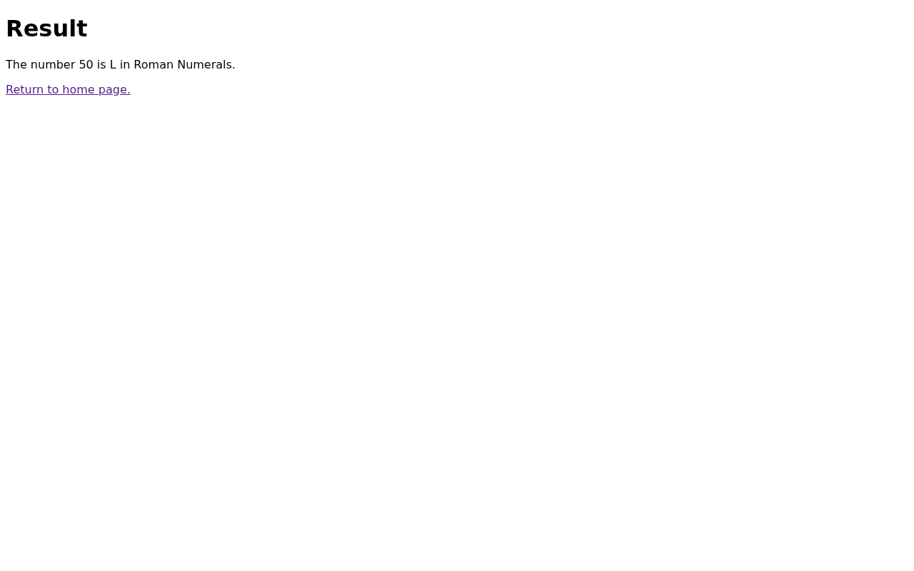

# Automating UI tests with Playwright & Antigravity CLI (agy)

This guide demonstrates how to automate User Interface (UI) testing using the
Antigravity CLI (agy) in conjunction with the [Playwright](https://playwright.dev/)
MCP server. By leveraging natural language prompts, developers can quickly define
and execute sophisticated end-to-end UI tests against a running application.
This approach streamlines UI test automation, highlighting easy environment
setup, effective natural language automation, and comprehensive testing reports
to accelerate software delivery and improve application quality.

## Requirements

To follow this demo, you need:

- A Google Cloud project with the Owner role.
- Go: Version 1.26 or higher.
- Antigravity CLI (agy): Installed and configured.
- Playwright: Installed as an MCP server.

### Install Antigravity CLI

If you haven't installed agy yet, run the following command:

```bash
curl -fsSL https://antigravity.google/cli/install.sh | bash
```

The binary will be installed to `~/.local/bin/agy`. Ensure this directory is in your `PATH`.

> **Note:** Initializing `agy` for the first time may require an interactive login (`/login`). If you are running in a non-interactive environment, ensure you have pre-authenticated or use a service account token if supported.

## Clone Git Repository

1. Open Cloud Shell.
2. Clone the sample repo:
   ```bash
   git clone https://github.com/GoogleCloudPlatform/testing-with-duet-ai-codelab.git && cd testing-with-duet-ai-codelab
   ```

## MCP Servers configuration

Antigravity CLI supports the Model Context Protocol (MCP). Create the `.antigravity/settings.json` folder and file within the cloned project, then add the Playwright MCP server configuration:

```bash
mkdir -p .antigravity && cat > .antigravity/settings.json <<EOF
{
  "mcpServers": {
    "playwright": {
      "command": "npx",
      "args": ["@playwright/mcp@latest"]
    }
  }
}
EOF
```

Launch the Antigravity CLI: `agy`
List available MCP servers to confirm Playwright is configured: `/mcp list`
The output should include `playwright - Ready`.
Press `Ctrl + C` twice or type `/exit` to exit `agy`.

## Prepare and Start Application

1. Set up a virtual environment and install required dependencies:
   ```bash
   python -m venv .venv
   source .venv/bin/activate
   pip install -r requirements.txt
   ```

2. Start the application:
   ```bash
   python main.py
   ```

## Test UI with Playwright MCP server

With the application running, start a new terminal session, change into the application folder and launch the Antigravity CLI:
```bash
cd testing-with-duet-ai-codelab
agy
```

Use the `/browser` capability or simply send the following prompt to start testing the application:

```text
/browser Open the app at http://127.0.0.1:8080/ and check that text “Roman Numerals” is present and the user can enter a number and hit Convert! Button. Run several conversions(10, 25, 50) and verify results. Close the browser after you are done and provide the testing report.
```

If prompted, confirm the installation of any necessary components, such as Chrome. Antigravity will orchestrate the Playwright commands and provide a report.

## Screenshots


## Walkthrough Demo
Refer to `demo-walkthrough.md` for a step-by-step recording of this guide in action.
